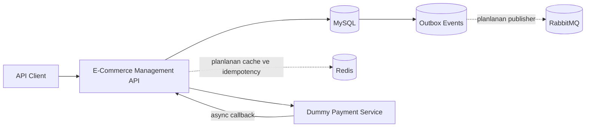

# E-Commerce Management API

Spring Boot ile geliştirilmiş, sipariş ve ödeme yaşam döngüsüne odaklanan bir e-ticaret yönetim API'si.

Proje; ürün, kategori, müşteri ve adres yönetiminin yanında stok rezervasyonu, kontrollü sipariş durum geçişleri, asenkron ödeme callback'i, ödeme iadesi ve Transactional Outbox için event kaydı gibi gerçek dünya problemlerini ele alır.

> Proje aktif olarak geliştirilmektedir. Tamamlanan ve planlanan çalışmalar [ROADMAP.md](ROADMAP.md) dosyasında takip edilir.

## Öne Çıkan Özellikler

- Kategori, müşteri, adres ve ürün yönetimi
- Sayfalama, filtreleme, arama ve sıralama
- Transaction içinde atomik stok rezervasyonu
- Sipariş kalemlerinde ürün adı, SKU ve fiyat snapshot'ı
- Kontrollü sipariş durum geçişleri ve durum geçmişi
- Ödeme yöntemleri için Strategy ve Factory yapısı
- Ayrı bir dummy ödeme sağlayıcısıyla HTTP tabanlı entegrasyon
- Asenkron ödeme sonucu callback'i
- Başarısız ödemede stok telafisi
- İdempotent ödeme iadesi
- Sipariş ve ödeme eventlerinin Transactional Outbox tablosuna kaydedilmesi
- Liquibase migration ve geliştirme ortamı için seed data
- Standart hata modeli ve request correlation ID
- Swagger UI / OpenAPI dokümantasyonu
- Docker Compose ile MySQL, Redis ve RabbitMQ altyapısı
- Controller, service, repository ve entegrasyon testleri

## Teknoloji Yığını

| Alan | Teknoloji |
| --- | --- |
| Dil | Java 21 |
| Framework | Spring Boot 4.1.1 |
| Web | Spring Web MVC |
| Veri erişimi | Spring Data JPA, Hibernate |
| Veritabanı | MySQL 8.4 |
| Migration | Liquibase |
| Cache / koordinasyon altyapısı | Redis 7.4 |
| Mesajlaşma altyapısı | RabbitMQ 4 |
| API dokümantasyonu | springdoc-openapi |
| Test | JUnit, Mockito, Spring Boot Test, H2 |
| Çalıştırma | Maven Wrapper, Docker, Docker Compose |

## Mimari



Uygulama katmanları `controller → service → repository` biçiminde ayrılmıştır. Request ve response DTO'ları entity modellerinden bağımsızdır. Sipariş oluşturma, stok rezervasyonu ve outbox kaydı aynı veritabanı transaction'ı içinde yürütülür.

### Güncel geliştirme durumu

| Özellik | Durum |
| --- | --- |
| CRUD ve listeleme API'leri | Tamamlandı |
| Sipariş oluşturma, detay, durum ve iptal | Tamamlandı |
| Dummy provider ile ödeme ve callback | Tamamlandı |
| Refund ve ödeme/sipariş event kayıtları | Tamamlandı |
| Redis tabanlı idempotency ve cache | Planlandı |
| Outbox publisher, RabbitMQ retry ve DLQ | Planlandı |
| Shipment strategy, attachment ve notification | Planlandı |

Redis ve RabbitMQ servisleri geliştirme altyapısında hazırdır; ancak uygulama tarafındaki cache, publisher ve consumer akışları henüz tamamlanmamıştır.

## Gereksinimler

- JDK 21 veya üzeri
- Docker ve Docker Compose
- Git

Maven'ın ayrıca kurulması gerekmez; proje Maven Wrapper içerir.

## Hızlı Başlangıç

### 1. Projeyi klonlayın

```bash
git clone https://github.com/berkeroner/ecommerce_management.git
cd ecommerce_management
```

### 2. Ortam dosyasını oluşturun

```bash
cp .env.example .env
```

`.env` içindeki aşağıdaki üç boş şifreyi doldurun:

```dotenv
MYSQL_ROOT_PASSWORD=your_root_password
ECOMMERCE_DB_PASSWORD=your_database_password
ECOMMERCE_RABBITMQ_PASSWORD=your_rabbitmq_password
```

`.env` Git tarafından takip edilmez. Gerçek şifreleri veya erişim bilgilerini repoya eklemeyin.

### 3. Altyapıyı başlatın

```bash
docker compose up -d mysql redis rabbitmq
```

Servis durumlarını kontrol etmek için:

```bash
docker compose ps
```

### 4. Ortam değişkenlerini yükleyin

Spring Boot `.env` dosyasını kendiliğinden okumaz. Terminal oturumu için değişkenleri yükleyin:

```bash
set -a
source .env
set +a
```

### 5. Uygulamayı çalıştırın

Örnek verilerle çalıştırmak için `dev` profilini kullanın:

```bash
./mvnw spring-boot:run -Dspring-boot.run.profiles=dev
```

API varsayılan olarak `http://localhost:8080` adresinde açılır.

`dev` profili Liquibase üzerinden 8 kategori, 24 müşteri, 48 ürün ve 30 müşteri adresi ekler. Seed kayıtları geliştirme amaçlıdır ve gerçek üretim verisi olarak kullanılmamalıdır.

## Dummy Ödeme Servisi

Ödeme akışını uçtan uca deneyebilmek için ayrı çalışan [dummy-payment-service](https://github.com/berkeroner/dummy-payment-service) gereklidir.

Yeni bir terminalde:

```bash
git clone https://github.com/berkeroner/dummy-payment-service.git
cd dummy-payment-service
./mvnw spring-boot:run
```

Varsayılan yerel adresler:

| Servis | Adres |
| --- | --- |
| E-Commerce Management API | `http://localhost:8080` |
| Dummy Payment Service | `http://localhost:8081` |
| Payment callback | `http://localhost:8080/api/v1/payments/callback` |

Ana uygulamanın provider adresi gerektiğinde değiştirilebilir:

```dotenv
DUMMY_PAYMENT_BASE_URL=http://localhost:8081
```

Dummy servis ödeme isteğini önce `PROCESSING` olarak kabul eder; kısa bir beklemenin ardından sonucu `APPROVED` veya `REJECTED` olarak belirleyip callback gönderir.

## Tamamen Docker ile Çalıştırma

Uygulama ve altyapıyı birlikte ayağa kaldırmak için:

```bash
SPRING_PROFILES_ACTIVE=dev docker compose up -d --build
```

Bu Compose dosyası ana API, MySQL, Redis ve RabbitMQ servislerini başlatır. Dummy ödeme sağlayıcısı ayrı bir projedir; ödeme entegrasyonu geliştirirken iki Java uygulamasını host üzerinde çalıştırmak en basit yerel geliştirme düzenidir.

Servisleri durdurmak için:

```bash
docker compose down
```

Veritabanı verisini korumak istiyorsanız `-v` kullanmayın. `docker compose down -v` kalıcı volume'ları da siler.

## API Dokümantasyonu

Uygulama çalışırken:

- Swagger UI: [http://localhost:8080/swagger-ui.html](http://localhost:8080/swagger-ui.html)
- OpenAPI JSON: [http://localhost:8080/v3/api-docs](http://localhost:8080/v3/api-docs)

Swagger UI üzerinden endpointleri inceleyebilir ve doğrudan istek gönderebilirsiniz.

## Endpoint Özeti

### Kategoriler

| Method | Endpoint | Açıklama |
| --- | --- | --- |
| `GET` | `/api/v1/categories` | Kategorileri listeler |
| `GET` | `/api/v1/categories/{id}` | Kategori detayını getirir |
| `POST` | `/api/v1/categories` | Kategori oluşturur |
| `PUT` | `/api/v1/categories/{id}` | Kategoriyi günceller |
| `DELETE` | `/api/v1/categories/{id}` | Kategoriyi siler |

### Müşteriler ve Adresler

| Method | Endpoint | Açıklama |
| --- | --- | --- |
| `GET` | `/api/v1/customers` | Sayfalı müşteri listesi |
| `GET` | `/api/v1/customers/{id}` | Müşteri detayını getirir |
| `POST` | `/api/v1/customers` | Müşteri oluşturur |
| `PUT` | `/api/v1/customers/{id}` | Müşteriyi günceller |
| `PATCH` | `/api/v1/customers/{id}/status` | Müşteri durumunu değiştirir |
| `GET` | `/api/v1/customers/{customerId}/addresses` | Müşteri adreslerini listeler |
| `GET` | `/api/v1/customers/{customerId}/addresses/{id}` | Adres detayını getirir |
| `POST` | `/api/v1/customers/{customerId}/addresses` | Adres oluşturur |
| `PUT` | `/api/v1/customers/{customerId}/addresses/{id}` | Adresi günceller |
| `DELETE` | `/api/v1/customers/{customerId}/addresses/{id}` | Adresi siler |

Müşteri listesi `page`, `limit`, `status` ve `search` parametrelerini destekler.

### Ürünler

| Method | Endpoint | Açıklama |
| --- | --- | --- |
| `GET` | `/api/v1/products` | Sayfalı ürün listesi |
| `GET` | `/api/v1/products/{id}` | Ürün detayını getirir |
| `POST` | `/api/v1/products` | Ürün oluşturur |
| `PUT` | `/api/v1/products/{id}` | Ürünü günceller |
| `PATCH` | `/api/v1/products/{id}/status` | Ürün durumunu değiştirir |
| `PATCH` | `/api/v1/products/{id}/stock` | Stok miktarını günceller |

Ürün listesi şu query parametrelerini destekler:

| Parametre | Açıklama | Örnek |
| --- | --- | --- |
| `page` | Sayfa numarası, 1'den başlar | `1` |
| `limit` | Sayfa boyutu | `20` |
| `category_id` | Kategori filtresi | `3` |
| `status` | `active` veya `passive` | `active` |
| `search` | Ürün adı veya SKU araması | `laptop` |
| `sort` | Alan ve yön | `price,asc` |

Örnek:

```http
GET /api/v1/products?page=1&limit=10&status=active&search=laptop&sort=price,asc
```

### Siparişler ve Ödemeler

| Method | Endpoint | Açıklama |
| --- | --- | --- |
| `POST` | `/api/v1/orders` | Sipariş oluşturur ve stok rezerve eder |
| `GET` | `/api/v1/orders/{id}` | Sipariş detayını getirir |
| `GET` | `/api/v1/orders/{id}/status` | Sipariş durumunu getirir |
| `POST` | `/api/v1/orders/{id}/cancel` | Siparişi iptal eder ve stoğu geri bırakır |
| `POST` | `/api/v1/orders/{id}/payments` | Dummy provider üzerinden ödeme başlatır |
| `POST` | `/api/v1/payments/{id}/refund` | Tamamlanmış ödemeyi iade eder |
| `POST` | `/api/v1/payments/callback` | Provider ödeme sonucunu kabul eder |

Callback endpoint'i servisler arası entegrasyon içindir; normal istemci akışında doğrudan çağrılmaz.

## Örnek Sipariş ve Ödeme Akışı

### 1. Sipariş oluşturma

```bash
curl --request POST http://localhost:8080/api/v1/orders \
  --header "Content-Type: application/json" \
  --header "X-Correlation-ID: demo-order-001" \
  --data '{
    "customer_id": 1,
    "payment_method": "credit_card",
    "shipping_provider": "mock",
    "shipping_address_id": 1,
    "billing_address_id": 2,
    "items": [
      {
        "product_id": 1,
        "quantity": 2
      }
    ]
  }'
```

`shipping_address_id` müşterinin kayıtlı teslimat adresini belirtir. Fatura adresi
farklıysa `billing_address_id` gönderilir; gönderilmezse teslimat adresi fatura
adresi olarak da kullanılır. Her iki adres sipariş anındaki haliyle siparişe
kopyalanır; müşteri daha sonra kayıtlı adresini değiştirse bile geçmiş sipariş
değişmez.

Örnek `201 Created` yanıtı:

```json
{
  "data": {
    "id": 42,
    "order_no": "ORD-550e8400-e29b-41d4-a716-446655440000",
    "status": "processing",
    "total_amount": 37999.80,
    "currency": "TRY"
  }
}
```

Örnekteki müşteri ve ürün ID'lerini kendi veritabanınızdaki aktif kayıtlarla değiştirin.

Sipariş oluşturulurken ürün fiyatı ve kimlik bilgileri sipariş kalemine snapshot olarak yazılır; stok atomik olarak azaltılır ve `order.created` event'i outbox tablosuna eklenir.

### 2. Ödeme başlatma

Dummy ödeme servisi çalışırken:

```bash
curl --request POST http://localhost:8080/api/v1/orders/42/payments \
  --header "Content-Type: application/json" \
  --data '{
    "method": "credit_card",
    "payment_token": "mock-token-123"
  }'
```

API `202 Accepted` ile `processing` durumundaki ödeme kaydını döner. Dummy servis callback gönderdiğinde:

- `APPROVED`: ödeme `completed`, sipariş `confirmed` olur.
- `REJECTED`: ödeme ve sipariş `failed` olur, rezerve edilen stok geri bırakılır.

Desteklenen ödeme yöntemleri:

- `credit_card`
- `bank_transfer`
- `cash_on_delivery`

## Hata Modeli

API hataları ortak bir gövdeyle döner:

```json
{
  "error": {
    "code": "VALIDATION_ERROR",
    "message": "Request validation failed",
    "details": {
      "items": [
        "must not be empty"
      ]
    },
    "correlation_id": "demo-order-001"
  }
}
```

İsteklerde `X-Correlation-ID` header'ı gönderilebilir. Header verilmezse uygulama bir değer üretir; bu değer response header'ına, hata gövdesine ve loglara taşınır.

Başlıca HTTP durum kodları:

| Kod | Kullanım |
| --- | --- |
| `200` | Başarılı okuma veya güncelleme |
| `201` | Kaynak oluşturuldu |
| `202` | Ödeme işlenmek üzere kabul edildi |
| `204` | Gövdesiz başarılı yanıt |
| `400` | Bozuk veya semantik olarak geçersiz istek |
| `404` | Kaynak bulunamadı |
| `409` | Stok, unique alan veya durum geçişi çakışması |
| `422` | DTO validation hatası |
| `500` | Beklenmeyen sunucu hatası |

## Veritabanı ve Migration

Şema Liquibase tarafından yönetilir:

```text
src/main/resources/db/changelog/
├── db.changelog-master.yaml
├── changes/
│   └── 001-initial-schema.yaml
└── seed/
    └── realistic-seed.sql
```

Hibernate `ddl-auto=validate` modunda çalışır; şemayı değiştirmez, entity ve migration uyumunu doğrular.

Başlıca tablolar:

- `customers`, `categories`, `products`
- `orders`, `order_items`, `order_status_histories`
- `addresses`
- `payments`, `shipments`, `attachments`
- `outbox_events`

Adresler `customer` veya `order`, ek dosya kayıtları ise `product`, `order` veya `payment` ile ilişkilendirilebilecek polymorphic şemaya sahiptir. Attachment ve shipment API'leri henüz geliştirme planındadır.

## Testler

Testler H2 ve teste özel yapılandırmayla çalışır; `.env`, MySQL, Redis veya RabbitMQ gerektirmez:

```bash
./mvnw clean test
```

Test kapsamı controller sözleşmeleri, service iş kuralları, repository sorguları, sipariş transaction'ları, stok telafisi, ödeme callback'i, rollback davranışı, seed data ve OpenAPI üretimini içerir.

## Proje Yapısı

```text
src/main/java/com/ecommerce/management/
├── client/         # Dış servis istemcileri
├── config/         # OpenAPI ve uygulama yapılandırmaları
├── controller/     # REST API katmanı
├── dto/            # Request ve response modelleri
├── entity/         # JPA entity ve enum modelleri
├── payment/        # Payment Strategy implementasyonları ve factory
├── repository/     # Spring Data repository katmanı
├── service/        # İş kuralları ve transaction sınırları
└── web/            # Hata yönetimi ve correlation ID filtresi
```

## Yol Haritası

Yaklaşan başlıca çalışmalar:

1. Redis tabanlı sipariş idempotency desteği
2. Product cache ve cache invalidation
3. Outbox publisher, RabbitMQ retry ve Dead Letter Queue
4. Idempotent event consumer'ları
5. Shipment strategy ve kargo yaşam döngüsü
6. Attachment ve notification akışları
7. Testcontainers, metrics ve tracing

Ayrıntılı ve güncel görev listesi için [ROADMAP.md](ROADMAP.md) dosyasına bakın.

## Güvenlik Notu

Bu proje eğitim ve geliştirme amaçlıdır. Gerçek kart numarası, CVV veya hassas ödeme bilgisi kabul etmez ve saklamaz. Üretim kullanımı için authentication, authorization, secret management, rate limiting ve ek güvenlik kontrolleri gereklidir.
